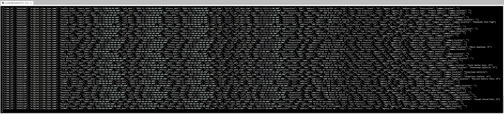
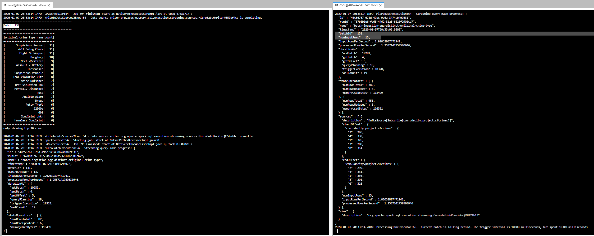
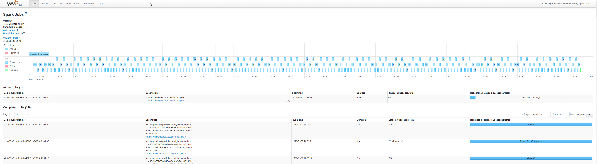
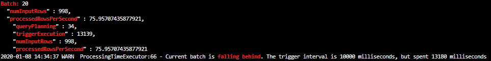
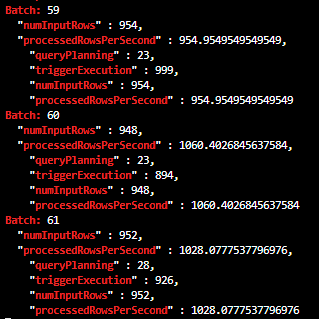

# Udacity Data Streaming Project - SF Crime Statistics with Spark Streaming

## Project Submission 

### Step 1:
Instructions:
Take a screenshot of your progress reporter after executing a Spark job. 

### Step 2: 
Instructions:
Take a screenshot of your progress reporter after executing a Spark job.

Take a screenshot of the Spark Streaming UI as the streaming continues. 

### Step 3:

Instructions: 

1. How did changing values on the SparkSession property parameters affect the throughput and latency of the data?

    It had a significant impact on increasing throughput and decreaing latency.

2. What were the 2-3 most efficient SparkSession property key/value pairs? Through testing multiple variations on values, how can you tell these were the most optimal?

		Initial Settings : 
			Kafka Produce Rate ~ 1000 events / s
			Spark Stream: maxOffsetsPerTrigger  = 1000
			Spark query: trigger: processingTime  = 10 seconds

    With these settings, the micro batches took longer to complete than the 10 second trigger period, as can be seen from the message "Current batch is falling behind" in the image below. This has a negative knock on affect as the next trigger will not execute until the previous one completes.

    

    Additionally, tuning Spark.executor memory had no impact, as we are running spark standalone, and as we had no memory bounds to begin with Spark.executor.memory also provided no significant improvements.

	Significantly increasing Spark.default.parallelism had a small positive impact ( ~500 ).
		
	But by far the main improvement was from adjusting the Spark.sql.shuffle.partitions configuration parameter.
		
	In spark, shuffle operations are expensive, which is why parallelising  them is important for fast operations.
		
	Our spark job has several dataframe operations that will trigger shuffling ( groupBy / joins / distinct ).
		
	Additionally by default, Spark.sql.shuffle.partitions is set to 200, which is ideal for large datasets, but far too much for the small streams we are dealing with.
	(Reference : http://blog.madhukaraphatak.com/dynamic-spark-shuffle-partitions/ )
		
	With the default values, you can see in the 
		
	Reducing this to 5 had amazing performance improvements, with the number processedRowsPerSecond peaking at over 1000/s, with the improvement due to the reduced number of shuffling tasks being performed.
    
    

